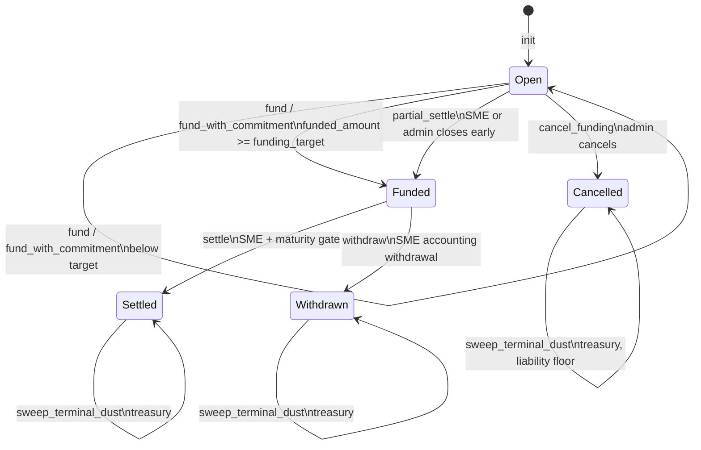

# LiquiFact Escrow State Machine

This document is the code-facing state-machine reference for
`InvoiceEscrow::status` in `escrow/src/lib.rs`. It covers all current states,
including the cancelled branch used by `cancel_funding` and `refund`.

## Status Values

| Value | Name | Meaning |
| ---: | --- | --- |
| `0` | Open | Escrow accepts investor funding and admin configuration updates. |
| `1` | Funded | Funding has closed; SME may settle or withdraw. |
| `2` | Settled | SME finalized settlement; investors may claim payout. |
| `3` | Withdrawn | SME withdrew liquidity; terminal operational state. |
| `4` | Cancelled | Admin cancelled open funding; investors may recover principal through refunds. |

`status` is stored in `DataKey::Escrow` as part of the full `InvoiceEscrow`
snapshot. State changes rewrite the snapshot atomically in a single host
function call.

## Mermaid Diagram



## Transition Table

| Entrypoint | Source status | Target status | Required role | Legal-hold gate | Status guard | Notes |
| --- | --- | --- | --- | --- | --- | --- |
| `init` | none | `0` open | Admin address supplied at init | None | Rejects already initialized escrow | Binds funding token, treasury, optional registry, and immutable initial terms. |
| `fund` | `0` open | `0` open or `1` funded | Investor | Blocks when legal hold is active | Requires `status == 0` | Transitions to funded once `funded_amount >= funding_target`; writes `FundingCloseSnapshot` once. |
| `fund_with_commitment` | `0` open | `0` open or `1` funded | Investor | Blocks when legal hold is active | Requires `status == 0` | First deposit only for tiered yield; may set an investor claim lock. |
| `partial_settle` | `0` open | `1` funded | SME or admin | Blocks when legal hold is active | Requires `status == 0` | Closes funding early and writes `FundingCloseSnapshot` if absent. |
| `settle` | `1` funded | `2` settled | SME | Blocks when legal hold is active | Requires `status == 1` | If maturity is non-zero, ledger timestamp must be `>= maturity`. |
| `withdraw` | `1` funded | `3` withdrawn | SME | Blocks when legal hold is active | Requires `status == 1` | Mutually exclusive with `settle`; records SME withdrawal. |
| `claim_investor_payout` | `2` settled | `2` settled | Investor | Blocks when legal hold is active | Requires `status == 2` | Idempotent after claim marker is written; no status transition. |
| `cancel_funding` | `0` open | `4` cancelled | Admin | Blocks when legal hold is active | Requires `status == 0` | Opens the refund path for investors with recorded principal. |
| `refund` | `4` cancelled | `4` cancelled | Investor | No legal-hold gate in current code | Requires `status == 4` | Zeroes contribution before transfer and increments distributed principal. |
| `sweep_terminal_dust` | `2`, `3`, or `4` | unchanged | Treasury | Blocks when legal hold is active | Requires terminal status | For cancelled escrows, enforces the outstanding refund liability floor. |

## Terminal And Operational States

`settled`, `withdrawn`, and `cancelled` are terminal for the core funding
lifecycle. They do not move back to `open` or `funded`.

- `settled` supports investor payout claims.
- `withdrawn` records that the SME has pulled liquidity.
- `cancelled` supports investor refunds and liability-aware treasury dust sweeping.

`refund` and `claim_investor_payout` are recovery/claim operations. They keep the
escrow in the same terminal state while mutating per-investor markers.

## Forbidden Transitions

The contract does not expose entrypoints for:

- `1 -> 0`, `2 -> 1`, `3 -> 1`, or `4 -> 0` regressions.
- Funding after `status != 0`.
- Cancellation after funding has closed (`status != 0`).
- Settlement or withdrawal before funding has closed (`status != 1`).
- Investor payout claims before settlement (`status != 2`).
- Refunds unless the escrow is cancelled (`status != 4`).

`settle` and `withdraw` are mutually exclusive because both require
`status == 1` and then move the escrow to different terminal states.

## Legal Hold Interaction

Legal hold blocks risk-bearing state changes in the current implementation:

- `fund` and `fund_with_commitment`
- `partial_settle`
- `settle`
- `withdraw`
- `claim_investor_payout`
- `cancel_funding`
- `sweep_terminal_dust`

`refund` does not currently check legal hold. It is available only after
`cancel_funding` moves the escrow to `status == 4`, and it returns recorded
principal to the authenticated investor.

## Cancelled Branch And Liability Floor

`cancel_funding` moves an open escrow to `status == 4` and emits
`FundingCancelled`. Each `refund`:

1. Requires the investor's authorization.
2. Requires `status == 4`.
3. Reads the investor's persistent contribution.
4. Zeroes the contribution and marks `InvestorRefunded`.
5. Adds the amount to `DistributedPrincipal`.
6. Transfers the funding token back to the investor.
7. Emits `InvestorRefundedEvt`.

`sweep_terminal_dust` may run in `status == 4`, but only if the post-sweep
balance remains at or above:

```text
funded_amount - distributed_principal
```

This protects principal still owed to investors who have not called `refund`.

## Events

| Transition or operation | Event |
| --- | --- |
| `init` | `EscrowInitialized` |
| `fund`, `fund_with_commitment` | `EscrowFunded` |
| `partial_settle` | `EscrowPartialSettle` |
| `settle` | `EscrowSettled` |
| `withdraw` | `SmeWithdrew` |
| `claim_investor_payout` | `InvestorPayoutClaimed` |
| `cancel_funding` | `FundingCancelled` |
| `refund` | `InvestorRefundedEvt` |
| `sweep_terminal_dust` | `TreasuryDustSwept` |

See `docs/EVENT_SCHEMA.md` for the topic and payload layout.

## Invariants For Reviewers

- State transitions are forward-only across the funding lifecycle.
- `FundingCloseSnapshot` is written once when the escrow first reaches
  `status == 1`.
- Per-investor contributions are stored in persistent storage and are zeroed
  before refund transfer.
- Terminal dust sweeps are restricted to statuses `2`, `3`, and `4`.
- Cancelled dust sweeps must preserve the outstanding refund liability floor.
- No entrypoint silently reopens a settled, withdrawn, or cancelled escrow.
