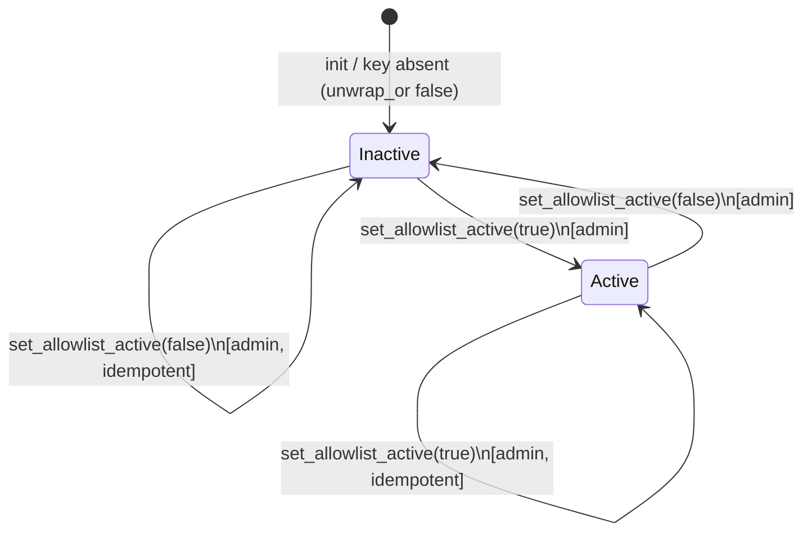
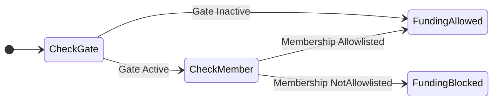

# Allowlist State Diagram

This note documents the investor allowlist **state machine** as implemented in
`escrow/src/lib.rs`. It covers the gate toggle, per-investor membership, the
transitions each entrypoint may perform, and how the funding path enforces the
combined state.

> **Companion docs:** data model and invariants in [`allowlist.md`](allowlist.md);
> authorization in [`allowlist-auth.md`](allowlist-auth.md); error codes in
> [`allowlist-errors.md`](allowlist-errors.md); escrow status machine in
> [`STATE_MACHINE_IMPLEMENTATION.md`](STATE_MACHINE_IMPLEMENTATION.md).

Source of truth: `escrow/src/lib.rs` —
`set_allowlist_active`, `set_investor_allowlisted`, `set_investors_allowlisted`,
`is_allowlist_active`, `is_investor_allowlisted`, and the allowlist check inside
`fund_impl`.

---

## Two Orthogonal State Spaces

The allowlist is **not** a single enum. It is two independent pieces of state
whose product determines whether an address may fund:

| Space | Storage key | Type | Default when absent |
| --- | --- | --- | --- |
| **Gate** | `DataKey::AllowlistActive` (instance) | `bool` | `false` (inactive) |
| **Membership** | `DataKey::InvestorAllowlisted(Address)` (persistent) | `bool` | `false` (not allowlisted) |

Toggling the gate does not mutate membership entries, and mutating membership
does not change the gate. Reads use `unwrap_or(false)` in both spaces.

A secondary index (`DataKey::AllowlistIndex`) tracks addresses that have
transitioned into membership; it does not participate in the funding gate.

---

## Gate State Diagram



### Gate states

| State | Stored value | Funding effect |
| --- | --- | --- |
| **Inactive** | `false` or key absent | Membership is ignored; any investor may fund (subject to other escrow guards). |
| **Active** | `true` | Membership is enforced; non-allowlisted investors are rejected. |

### Gate transitions

| From | To | Entrypoint | Auth | Event |
| --- | --- | --- | --- | --- |
| Inactive | Active | `set_allowlist_active(true)` | Admin (`load_escrow_require_admin`) | `AllowlistEnabledChanged` (`al_ena`, `active = 1`) |
| Active | Inactive | `set_allowlist_active(false)` | Admin | `AllowlistEnabledChanged` (`al_ena`, `active = 0`) |
| Same | Same | `set_allowlist_active(active)` with current value | Admin | Still emits `AllowlistEnabledChanged` |

There is **no** typed error for gate writes under admin auth. Non-admin callers
fail with a host authorization trap before storage is touched.

**Read view:** `is_allowlist_active()` — no auth.

---

## Membership State Diagram

Per investor address:

```mermaid
stateDiagram-v2
    [*] --> NotAllowlisted : never written / archived / explicit false

    NotAllowlisted --> Allowlisted : set_investor_allowlisted(addr, true)\nor set_investors_allowlisted([…], true)\n[admin]
    Allowlisted --> NotAllowlisted : set_investor_allowlisted(addr, false)\nor set_investors_allowlisted([…], false)\n[admin]

    Allowlisted --> Allowlisted : set_* (…, true) while already true\n[admin, index no-op]
    NotAllowlisted --> NotAllowlisted : set_* (…, false) while already false\n[admin, index no-op]

    Allowlisted --> NotAllowlisted : persistent TTL archival\n(environmental; reads as absent → false)
```



### Membership states

| State | Meaning | `is_investor_allowlisted(addr)` |
| --- | --- | --- |
| **NotAllowlisted** | Key absent, archived, or explicitly `false` | `false` |
| **Allowlisted** | Persistent key present and `true` | `true` |

Absent and explicit `false` are observationally identical on every read and
funding check.

### Membership transitions

| From | To | Entrypoint(s) | Index side effect (`AllowlistIndex`) | Event |
| --- | --- | --- | --- | --- |
| NotAllowlisted | Allowlisted | `set_investor_allowlisted(addr, true)`; `set_investors_allowlisted([…], true)` | Append `addr` on first `false → true` (single-address path persists the index) | `InvestorAllowlistChanged` (`al_set`, `allowed = 1`) |
| Allowlisted | NotAllowlisted | `set_investor_allowlisted(addr, false)`; `set_investors_allowlisted([…], false)` | Position-match remove / swap-remove on first `true → false` (single-address path) | `InvestorAllowlistChanged` (`al_set`, `allowed = 0`) |
| Allowlisted | Allowlisted | Idempotent allow (`allowed = true`) | No re-append | Still emits `al_set` |
| NotAllowlisted | NotAllowlisted | Idempotent revoke (`allowed = false`) | No index change | Still emits `al_set` |
| Allowlisted | NotAllowlisted | Ledger TTL archival of the persistent key | Index may retain a stale address until a revoke sweep; live reads filter it out | None (off-chain / host) |

**Batch bounds** on `set_investors_allowlisted`:

- empty vector → `EscrowError::InvestorBatchEmpty` (`70`)
- `len > MAX_INVESTOR_ALLOWLIST_BATCH` (32) → `EscrowError::InvestorBatchTooLarge` (`71`)

Admin writes do **not** call `extend_ttl` on `InvestorAllowlisted(addr)`. TTL
renewal is permissionless via `bump_ttl(allowlisted)` (does not change
membership state; only extends rent).

**Read views (no auth):** `is_investor_allowlisted`, `get_allowlisted_investors`,
`get_allowlisted_investors_count`, `get_allowlist_page` — the list/count/page
views re-check live membership and skip revoked or archived entries.

---

## Combined Funding Outcome

The funding path does not store a third state. Inside `fund_impl` (shared by
`fund`, `fund_with_commitment`, and each leg of `fund_batch`):

```rust
if Self::is_allowlist_active(env.clone()) {
    ensure(
        &env,
        Self::is_investor_allowlisted(env.clone(), investor.clone()),
        EscrowError::InvestorNotAllowlisted,
    );
}
```



| Gate | Membership | May fund? | Typed error |
| --- | --- | --- | --- |
| Inactive | *any* | Yes (gate bypassed) | — |
| Active | Allowlisted | Yes | — |
| Active | NotAllowlisted | No | `InvestorNotAllowlisted` (`104`) |

The allowlist check runs only after earlier `fund_impl` guards (auth, amount,
pause, legal hold, open status, funding deadline). A failure on those guards
never consults membership.

---

## Entrypoint Cross-Reference

| Entrypoint | Role | States touched | Transition / enforcement |
| --- | --- | --- | --- |
| `set_allowlist_active(active)` | Admin write | Gate | Inactive ↔ Active (idempotent write + `al_ena`) |
| `set_investor_allowlisted(investor, allowed)` | Admin write | Membership (+ `AllowlistIndex`) | NotAllowlisted ↔ Allowlisted; append / swap-remove index on edge transitions |
| `set_investors_allowlisted(investors, allowed)` | Admin write | Membership (batch) | Same membership transitions per address; rejects empty / oversized batches (`70` / `71`) |
| `is_allowlist_active()` | Anyone read | Gate (read) | Observes gate; no transition |
| `is_investor_allowlisted(investor)` | Anyone read | Membership (read) | Observes membership; absent ⇒ `false` |
| `get_allowlisted_investors` / `_count` / `get_allowlist_page` | Anyone read | Membership + index (read) | Filter to live Allowlisted only |
| `bump_ttl(allowlisted)` | Anyone write (TTL only) | Membership TTL | No state transition; extends persistent / instance TTL |
| `fund` / `fund_with_commitment` / `fund_batch` | Investor | Gate + Membership (enforce) | Active ∧ ¬Allowlisted ⇒ `InvestorNotAllowlisted` (`104`) |

---

## Forbidden / No-Op Notes

- **No escrow-status coupling.** Gate and membership may change in any escrow
  status (`Open`, `Funded`, `Settled`, `Withdrawn`, `Cancelled`). Changes affect
  **future** funding attempts only; existing contributions are not rewritten.
- **No self-service membership.** Investors cannot add or remove themselves;
  only admin paths mutate membership.
- **No automatic gate enable.** Adding addresses never turns the gate on.
- **No automatic membership clear.** Disabling the gate never deletes
  `InvestorAllowlisted` entries or the index.
- **Archival ≡ revoke for enforcement.** An archived persistent key reads as
  NotAllowlisted and is rejected when the gate is Active.

---

## Minimal Lifecycle

```
1. init                         → Gate = Inactive, all membership = NotAllowlisted
2. set_investor_allowlisted(A, true)
                                → A: NotAllowlisted → Allowlisted (gate still off)
3. set_allowlist_active(true)   → Gate: Inactive → Active
4. A funds                      → allowed (Active ∧ Allowlisted)
5. B funds                      → InvestorNotAllowlisted (104)
6. set_investor_allowlisted(A, false)
                                → A: Allowlisted → NotAllowlisted
7. A funds again                → InvestorNotAllowlisted (104)
8. set_allowlist_active(false)  → Gate: Active → Inactive; A/B membership unchanged
9. B funds                      → allowed (gate bypassed)
```
