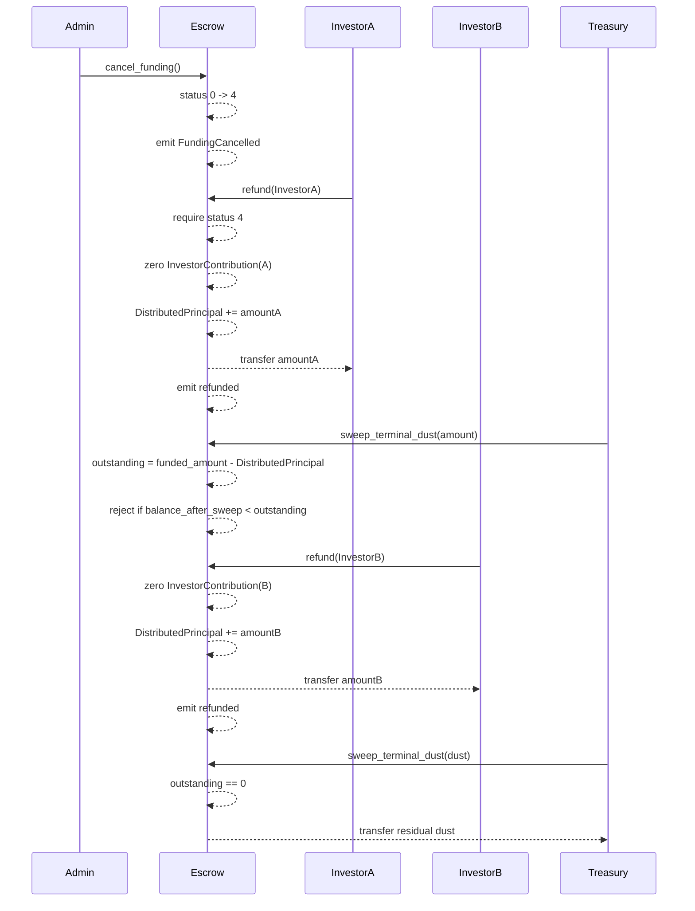

# Cancelled Escrow Refund Lifecycle

This document is the operator and integrator narrative for the `open -> cancelled -> refund -> dust sweep` path.

Cancellation is only for an escrow that is still open (`status = 0`). After cancellation (`status = 4`), investors recover recorded principal through `refund(investor)`. Treasury dust sweeping remains available, but a liability floor prevents sweeping funding-token principal that is still owed to investors.

## Actors and Storage

| Actor or key | Role |
| --- | --- |
| `InvoiceEscrow::admin` | Only caller allowed to cancel an open escrow. |
| Investor address | Calls `refund(investor)` for its own recorded contribution. |
| `DataKey::InvestorContribution(Address)` | Principal owed to that investor while refundable. |
| `DataKey::InvestorRefunded(Address)` | Boolean marker set after successful refund. |
| `DataKey::DistributedPrincipal` | Running total of principal already returned through `refund`. |
| `DataKey::Treasury` | Only recipient of `sweep_terminal_dust`. |

## State Transition

`cancel_funding()` transitions `status 0 -> 4`.

Requirements:

- The escrow must be initialized.
- The caller must be the current admin.
- Legal hold must be inactive.
- The current status must be open (`0`).

Effects:

- `InvoiceEscrow.status` is written as `4`.
- `FundingCancelled` is emitted.
- Funding, settlement, and withdrawal paths remain closed.
- `refund(investor)` becomes the investor principal recovery path.
- `sweep_terminal_dust(amount)` is allowed because cancelled is terminal, subject to the liability floor below.

## Refund Path

`refund(investor)` returns one investor's recorded principal.

Requirements:

- `investor.require_auth()` succeeds.
- Escrow status is cancelled (`4`), otherwise `RefundNotCancelled`.
- `DataKey::InvestorContribution(investor) > 0`, otherwise `NoContributionToRefund`.
- Funding token and treasury-era initialization data are present.
- The outbound token wrapper observes exact balance deltas.

Effects:

- The investor contribution is set to `0` before transfer, preventing a second refund.
- `DataKey::InvestorRefunded(investor)` is set to `true`.
- `DataKey::DistributedPrincipal` increases by the refunded amount.
- Funding token principal is transferred from the escrow contract to the investor.
- `InvestorRefundedEvt` is emitted with event name `refunded`, the investor, invoice id, and amount.

The zero-before-transfer ordering is intentional. A failed second call finds contribution `0` and fails instead of reusing stale contribution state.

## Liability Floor

Cancelled escrows use on-chain refunds, so the contract must retain enough balance for investors that have not yet refunded.

The sweep floor is:

```text
outstanding = funded_amount - distributed_principal
balance_after_sweep >= outstanding
```

`sweep_terminal_dust(amount)` computes the effective sweep as `min(amount, contract_balance)`, then checks the floor when `status == 4`. If sweeping would reduce the escrow balance below outstanding refundable principal, the call aborts. This protects investors who have not yet called `refund`.

The floor is not applied in settled (`2`) or withdrawn (`3`) states because those states use settlement or off-chain disbursement flows, not the cancelled-escrow refund path.

## Worked Example

Assume:

- Funding target: 1,000 units.
- Investor A contributed 300.
- Investor B contributed 200.
- Escrow contract balance is 505 because 5 units were accidentally left as dust.
- `funded_amount = 500`.
- `distributed_principal = 0`.

1. Admin calls `cancel_funding()`.
   - Status becomes `4`.
   - Outstanding liability is `500 - 0 = 500`.
   - Treasury cannot sweep 5 yet if doing so would leave less than 500.

2. Investor A calls `refund(A)`.
   - A receives 300.
   - A's contribution becomes 0.
   - `InvestorRefunded(A) = true`.
   - `distributed_principal = 300`.
   - Outstanding liability is `500 - 300 = 200`.

3. Treasury still cannot sweep 305.
   - Balance is 205.
   - Sweeping 305 is capped to 205, but that would leave 0.
   - 0 is below outstanding 200, so the floor blocks it.

4. Investor B calls `refund(B)`.
   - B receives 200.
   - B's contribution becomes 0.
   - `InvestorRefunded(B) = true`.
   - `distributed_principal = 500`.
   - Outstanding liability is `500 - 500 = 0`.

5. Treasury calls `sweep_terminal_dust(5)`.
   - Balance is 5.
   - Outstanding is 0.
   - Sweep succeeds and transfers the residual 5 to treasury.

## Sequence Diagram



## Operator Checklist

Before cancellation:

- Confirm the escrow is still open (`status = 0`).
- Confirm legal hold is inactive.
- Confirm the admin signer is authorized.
- Notify integrators that settlement and withdrawal will no longer be available for this escrow.

After cancellation:

- Direct investors to call `refund(investor)` with their own signer.
- Track `get_distributed_principal()` against `funded_amount`.
- Use `is_investor_refunded(investor)` for per-investor support checks.
- Do not sweep treasury dust until every expected investor has refunded or the liability floor proves the requested sweep cannot consume outstanding principal.

## Tests Covering This Flow

Existing tests under `escrow/src/tests/funding.rs` cover the documented behavior:

- `test_cancel_funding_transitions_to_status_4`
- `test_cancel_funding_requires_admin_auth`
- `test_cancel_funding_panics_if_already_funded`
- `test_cancel_funding_blocked_by_legal_hold`
- `test_refund_returns_principal_to_investor`
- `test_refund_zeroes_contribution`
- `test_refund_marks_investor_refunded`
- `test_refund_double_spend_panics`
- `test_refund_multiple_investors_independent`
- `test_sweep_terminal_dust_allowed_in_cancelled_state`

Auth-audit coverage in `escrow/src/tests/admin.rs` also asserts admin-only cancellation, investor-only refund, and treasury-only dust sweep behavior.
