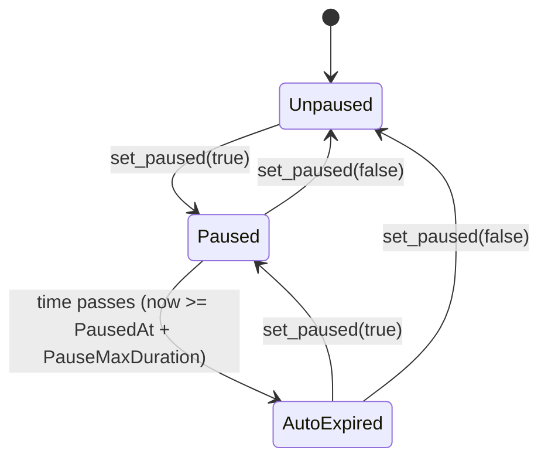

# Operational Pause State Machine

The operational pause (`DataKey::Paused`) is a lightweight incident-response circuit breaker that can be toggled by the `admin`. It is orthogonal to the compliance legal hold and carries no compliance semantics.

## State Diagram

## States

1. **Unpaused**
   - The default operational state where `DataKey::Paused` is `false` or absent.
   - All standard operations and entrypoints are permitted (unless blocked by other gates such as the legal hold).

2. **Paused**
   - The circuit breaker is active (`DataKey::Paused == true`).
   - The state is within the configured max duration window (`now < PausedAt + PauseMaxDuration`). If `PauseMaxDuration == 0`, it does not expire.
   - Critical operations are blocked.

3. **AutoExpired**
   - `DataKey::Paused` is physically `true` in storage, but the pause has surpassed its maximum duration (`now >= PausedAt + PauseMaxDuration`).
   - The contract evaluates this state exactly as **Unpaused**.

## Enforcing Entrypoints

When the contract evaluates as `Paused` (via the internal `paused_active` predicate), the following entrypoints are blocked, returning their respective typed errors:

| Entrypoint | Error Code | Description |
|---|---|---|
| `fund`, `fund_with_commitment`, `fund_batch` | `PausedBlocksFunding` (210) | Prevents new principal from entering the escrow. |
| `settle` | `PausedBlocksSettlement` (211) | Halts finalizing the escrow. |
| `withdraw` | `PausedBlocksWithdrawal` (212) | Halts SME from withdrawing settled stablecoin. |
| `claim_investor_payout` | `PausedBlocksInvestorClaims` (213) | Prevents investors from claiming payouts on settled escrows. |

**Note on Rate Limiting**: The transition to `Paused` via `set_paused(true)` enforces an optional toggle rate limit over a sliding time window to mitigate admin key abuse. Unpausing (`set_paused(false)`) is never rate-limited.
