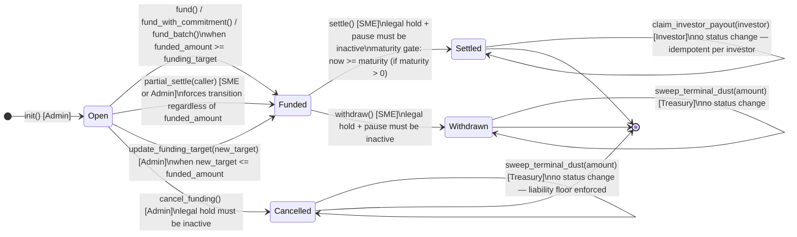

# Settlement State Machine

This document is the authoritative reference for the `InvoiceEscrow` status field. It covers
every valid state, every allowed transition, the entrypoints that enforce each transition, and
the orthogonal guards (legal hold, operational pause) that can block them.

> **Source of truth:** `escrow/src/types.rs` (`EscrowStatus` enum) and `escrow/src/lib.rs`
> (all `escrow.status =` assignments and `guard_status_eq` / `ensure` status checks).

---

## Status Values

| Value | Variant | Description |
|------:|---------|-------------|
| `0` | `Open` | Escrow initialized; accepting investor contributions. |
| `1` | `Funded` | Funding target reached, or forcibly advanced by `partial_settle` / `update_funding_target`. SME may settle or withdraw. |
| `2` | `Settled` | SME finalized settlement. Investor payout claims are unlocked. **Terminal for the status field.** |
| `3` | `Withdrawn` | SME pulled liquidity. **Terminal.** |
| `4` | `Cancelled` | Admin aborted funding while open. Investor refunds are unlocked. **Terminal.** |

Transitions are **strictly forward** — no entrypoint moves `status` backward.
`prop_status_only_increases` in `escrow/src/tests/properties.rs` enforces this as a proptest
invariant.

---

## State Diagram

---

## Transition Reference

### `[*] → Open (status 0)` — `init`

| Property | Detail |
|----------|--------|
| Entrypoint | `init(env, ...)` |
| Auth | Admin (passed as argument; no prior on-chain state to auth against) |
| Precondition | Contract must not already be initialized (`DataKey::Escrow` absent) |
| Source | `escrow/src/lib.rs` lines 2495, 3210 — `status: 0` in the initial `InvoiceEscrow` struct literal |
| Event | `EscrowInitialized` |

---

### `Open → Funded (0 → 1)` — funding entrypoints and target adjustment

Triggered automatically when `funded_amount >= funding_target`, or forced early by
`partial_settle` / `update_funding_target`.

#### `fund` / `fund_with_commitment` / `fund_batch`

| Property | Detail |
|----------|--------|
| Entrypoints | `fund(env, investor, amount)` · `fund_with_commitment(env, investor, amount, committed_lock_secs)` · `fund_batch(env, entries)` |
| Auth | Investor self-auth (`investor.require_auth()`) |
| Status precondition | `status == 0`; `EscrowNotOpenForFunding` (103) otherwise |
| Transition trigger | After crediting `amount` to `funded_amount`, checks `funded_amount >= funding_target`; sets `status = 1` if true |
| Snapshot | `FundingCloseSnapshot` written **once, atomically** on the first `0 → 1` transition (guarded by `!has(FundingCloseSnapshot)`) |
| Legal-hold gate | Blocks all three; `LegalHoldBlocksFunding` (110) |
| Pause gate | Blocks all three; `PausedBlocksFunding` (210) |
| Source | `lib.rs` lines 5848–5849 (`fund` / `fund_with_commitment` path in `fund_impl`); 5968–5969 (`fund_batch` path) |

#### `partial_settle`

| Property | Detail |
|----------|--------|
| Entrypoint | `partial_settle(env, caller)` |
| Auth | `caller.require_auth()` where `caller` must equal `sme_address` or `admin`; `PartialSettleUnauthorizedCaller` (200) otherwise |
| Status precondition | `status == 0` (Open); `PartialSettleNotOpen` (202) otherwise |
| Transition trigger | Unconditionally sets `status = 1` regardless of `funded_amount` vs `funding_target` |
| Snapshot | `FundingCloseSnapshot` written if not already present |
| Legal-hold gate | Blocks; `LegalHoldBlocksPartialSettle` (201) |
| Pause gate | **Not pause-gated** |
| Guard ordering | (1) legal-hold check → (2) `caller.require_auth()` → (3) caller identity check → (4) status check |
| Source | `lib.rs` lines 6063–6066 |

#### `update_funding_target`

| Property | Detail |
|----------|--------|
| Entrypoint | `update_funding_target(env, new_target)` |
| Auth | Admin (`load_escrow_require_admin`) |
| Status precondition | `status == 0`; `TargetUpdateNotOpen` otherwise |
| Transition trigger | If `funded_amount > 0` and `funded_amount >= new_target` and no snapshot exists, sets `status = 1` and writes `FundingCloseSnapshot` |
| Legal-hold gate | No legal-hold check on this entrypoint |
| Source | `lib.rs` lines 5167–5179 |

---

### `Open → Cancelled (0 → 4)` — `cancel_funding`

| Property | Detail |
|----------|--------|
| Entrypoint | `cancel_funding(env)` |
| Auth | Admin |
| Status precondition | `status == 0`; `CancelFundingNotOpen` (141) otherwise — funded, settled, withdrawn, and already-cancelled escrows cannot be cancelled |
| Legal-hold gate | Must be **inactive**; `LegalHoldBlocksCancelFunding` otherwise |
| Transition | Sets `status = 4` |
| Event | `FundingCancelled` (carries `funded_amount` at time of cancellation) |
| Unlocks | `refund()` for all contributing investors; `sweep_terminal_dust()` subject to liability floor |

---

### `Funded → Settled (1 → 2)` — `settle`

| Property | Detail |
|----------|--------|
| Entrypoint | `settle(env)` |
| Auth | SME (`load_escrow_require_sme` → `sme_address.require_auth()`) |
| Status precondition | `status == 1`; `SettlementNotFunded` (121) otherwise |
| Maturity gate | If `maturity > 0`, requires `ledger.timestamp() >= maturity`; `MaturityNotReached` (122). When `maturity == 0` this gate is skipped entirely (`has_maturity_lock = false`). |
| Legal-hold gate | Blocks; `LegalHoldBlocksSettlement` (120) |
| Pause gate | Blocks; `PausedBlocksSettlement` (211) |
| Guard ordering | (1) pause check → (2) legal-hold check → (3) `sme_address.require_auth()` → (4) status check → (5) maturity check |
| Transition | Sets `status = 2`; writes `DataKey::SettledAt` (ledger timestamp) |
| Event | `EscrowSettled` (carries `invoice_id`, `funded_amount`, `yield_bps`, `maturity`, `settled_at_ledger_timestamp`, `settle_pool`) |
| Unlocks | `claim_investor_payout()` for every investor |
| Source | `lib.rs` lines 6196–6222 |

---

### `Funded → Withdrawn (1 → 3)` — `withdraw`

| Property | Detail |
|----------|--------|
| Entrypoint | `withdraw(env)` |
| Auth | SME (`load_escrow_require_sme`) |
| Status precondition | `status == 1`; `WithdrawalNotFunded` (124) otherwise |
| Balance check | Contract must hold `>= funded_amount` tokens; `InsufficientContractBalance` (165) |
| Legal-hold gate | Blocks; `LegalHoldBlocksWithdrawal` (123) |
| Pause gate | Blocks; `PausedBlocksWithdrawal` (212) |
| Guard ordering | (1) pause check → (2) legal-hold check → (3) `sme_address.require_auth()` → (4) status check → (5) balance check |
| Fee split | `fee = funded_amount × fee_bps / 10_000` (floor); `net = funded_amount − fee`; fee transferred to treasury if `fee > 0`, net to SME if `net > 0` |
| Transition | Sets `status = 3`; increments `DistributedPrincipal` by gross `funded_amount` |
| Event | `SmeWithdrew` |
| Source | `lib.rs` lines 6325–6328 |

> **Mutual exclusivity:** `settle` and `withdraw` both require `status == 1`. Whichever runs
> first advances status to `2` or `3`, permanently blocking the other path.

---

## In-Terminal-State Actions (no status change)

These entrypoints operate on a terminal escrow but do **not** change `InvoiceEscrow.status`.

### `claim_investor_payout` — requires `Settled (2)`

| Property | Detail |
|----------|--------|
| Entrypoint | `claim_investor_payout(env, investor)` |
| Auth | Investor self-auth (`investor.require_auth()`) |
| Status precondition | `status == 2`; `InvestorClaimNotSettled` (127) otherwise |
| Contribution guard | `InvestorContribution > 0`; `NoContributionToClaim` (126) |
| Commitment-lock guard | `ledger.timestamp() >= InvestorClaimNotBefore`; `InvestorCommitmentLockNotExpired` (128) |
| Idempotency | Second call is a **silent no-op** — no error, no re-emit |
| Legal-hold gate | Blocks; `LegalHoldBlocksInvestorClaims` (125) |
| Pause gate | Blocks; `PausedBlocksInvestorClaims` (213) |
| Guard ordering | (1) pause → (2) legal hold → (3) `require_auth` → (4) contribution check → (5) status check → (6) commitment-lock check → (7) idempotency check |
| Event | `InvestorPayoutClaimed` |
| Source | `lib.rs` lines 6434–6470 |

### `refund` — requires `Cancelled (4)`

| Property | Detail |
|----------|--------|
| Entrypoint | `refund(env, investor)` |
| Auth | Investor self-auth |
| Status precondition | `status == 4`; `RefundNotCancelled` (142) otherwise |
| Idempotency | Zeroes `InvestorContribution` before the token transfer (checks-effects-interactions); a second call fails the contribution `> 0` guard |
| Accounting | Increments `DistributedPrincipal` by refunded amount |
| Legal-hold gate | Blocked when hold is active |
| Event | `InvestorRefundedEvt` |

### `sweep_terminal_dust` — requires `Settled (2)`, `Withdrawn (3)`, or `Cancelled (4)`

| Property | Detail |
|----------|--------|
| Entrypoint | `sweep_terminal_dust(env, amount)` |
| Auth | Treasury (`treasury.require_auth()`) |
| Status precondition | `status ∈ {2, 3, 4}` (`is_terminal_status` check); rejected on Open/Funded |
| Amount cap | `amount <= MAX_DUST_SWEEP_AMOUNT` (100 000 000 base units per call) |
| Liability floor (status 4 only) | `balance − amount >= funded_amount − distributed_principal`; `SweepExceedsLiabilityFloor` otherwise |
| Legal-hold gate | Blocked when hold is active |

---

## Orthogonal Cross-Cutting Guards

These flags are independent of `status`. Either can block an entrypoint on its own; clearing
one never clears the other.

### Legal Hold (`DataKey::LegalHold`)

Set and cleared by Admin via `set_legal_hold` / `clear_legal_hold` /
`clear_legal_hold_after_delay`. Governance-use; no built-in time-limit by default.

| Entrypoint blocked | Error code |
|--------------------|-----------|
| `fund` / `fund_with_commitment` / `fund_batch` | `LegalHoldBlocksFunding` (110) |
| `partial_settle` | `LegalHoldBlocksPartialSettle` (201) |
| `settle` | `LegalHoldBlocksSettlement` (120) |
| `withdraw` | `LegalHoldBlocksWithdrawal` (123) |
| `cancel_funding` | `LegalHoldBlocksCancelFunding` |
| `claim_investor_payout` | `LegalHoldBlocksInvestorClaims` (125) |
| `sweep_terminal_dust` | Blocked |

### Operational Pause (`DataKey::Paused`)

Set by Admin via `set_paused`. Lightweight incident-response circuit breaker. Auto-expires
when `set_pause_max_duration` is configured (default: no expiry until explicitly cleared).

| Entrypoint blocked | Error code |
|--------------------|-----------|
| `fund` / `fund_with_commitment` / `fund_batch` | `PausedBlocksFunding` (210) |
| `settle` | `PausedBlocksSettlement` (211) |
| `withdraw` | `PausedBlocksWithdrawal` (212) |
| `claim_investor_payout` | `PausedBlocksInvestorClaims` (213) |

> `partial_settle`, `cancel_funding`, and `refund` are **not** pause-gated.
> See [`docs/escrow-pause.md`](escrow-pause.md) for the full pause model.

---

## Forbidden Transitions

Any attempt to call a status-changing entrypoint from an incompatible state fails with a typed
error. No state is modified on failure (Soroban host reverts the transaction).

| Attempted call | From status | Typed error | Code |
|----------------|:-----------:|-------------|-----:|
| `fund` / `fund_with_commitment` / `fund_batch` | 1, 2, 3, 4 | `EscrowNotOpenForFunding` | 103 |
| `partial_settle` | 1, 2, 3, 4 | `PartialSettleNotOpen` | 202 |
| `cancel_funding` | 1, 2, 3, 4 | `CancelFundingNotOpen` | 141 |
| `settle` | 0, 2, 3, 4 | `SettlementNotFunded` | 121 |
| `withdraw` | 0, 2, 3, 4 | `WithdrawalNotFunded` | 124 |
| `claim_investor_payout` | 0, 1, 3, 4 | `InvestorClaimNotSettled` | 127 |
| `refund` | 0, 1, 2, 3 | `RefundNotCancelled` | 142 |

---

## `FundingCloseSnapshot` Immutability

`FundingCloseSnapshot` is written exactly once — on the first `0 → 1` transition — and is
never overwritten. It records the pro-rata denominator for off-chain payout math:

- `total_principal` — `funded_amount` at close
- `funding_target` — target at the time of close
- `closed_at_ledger_timestamp` / `closed_at_ledger_sequence`

All four code paths that trigger `0 → 1` guard against overwriting with
`!env.storage().instance().has(&DataKey::FundingCloseSnapshot)`.

Off-chain payout per investor: `investor_share = get_contribution(investor) / snapshot.total_principal`.

---

## Entrypoint Quick-Reference

| Entrypoint | Role | From status | To status | Status guard |
|------------|------|:-----------:|:---------:|:-------------|
| `init` | Admin | — | `0` | Contract uninitialized |
| `fund` | Investor | `0` | `0` or `1` | `status == 0` |
| `fund_with_commitment` | Investor | `0` | `0` or `1` | `status == 0` |
| `fund_batch` | Investor | `0` | `0` or `1` | `status == 0` |
| `partial_settle` | SME or Admin | `0` | `1` | `status == 0` |
| `update_funding_target` | Admin | `0` | `0` or `1` | `status == 0` |
| `cancel_funding` | Admin | `0` | `4` | `status == 0` |
| `settle` | SME | `1` | `2` | `status == 1` |
| `withdraw` | SME | `1` | `3` | `status == 1` |
| `claim_investor_payout` | Investor | `2` | `2` (no change) | `status == 2` |
| `refund` | Investor | `4` | `4` (no change) | `status == 4` |
| `sweep_terminal_dust` | Treasury | `2`, `3`, or `4` | no change | `status ∈ {2,3,4}` |

---

## See Also

- [`docs/adr/ADR-001-state-model.md`](adr/ADR-001-state-model.md) — design rationale for the five-state model
- [`docs/adr/ADR-003-settlement-flow.md`](adr/ADR-003-settlement-flow.md) — two-phase settlement design
- [`docs/adr/ADR-004-legal-hold.md`](adr/ADR-004-legal-hold.md) — legal hold mechanism
- [`docs/settlement-auth.md`](settlement-auth.md) — per-entrypoint authorization details
- [`docs/settlement-errors.md`](settlement-errors.md) — all typed error codes for settlement entrypoints
- [`docs/escrow-cancellation-refunds.md`](escrow-cancellation-refunds.md) — cancellation and refund lifecycle
- [`docs/escrow-pause.md`](escrow-pause.md) — operational pause model
- [`docs/escrow-legal-hold.md`](escrow-legal-hold.md) — legal hold lifecycle
- [`docs/funding-states.md`](funding-states.md) — funding-phase state machine (companion document)
- [`docs/escrow-snapshot.md`](escrow-snapshot.md) — `FundingCloseSnapshot` invariants
- [`docs/escrow-ledger-time.md`](escrow-ledger-time.md) — maturity and ledger-time model
